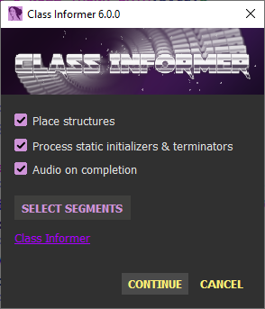
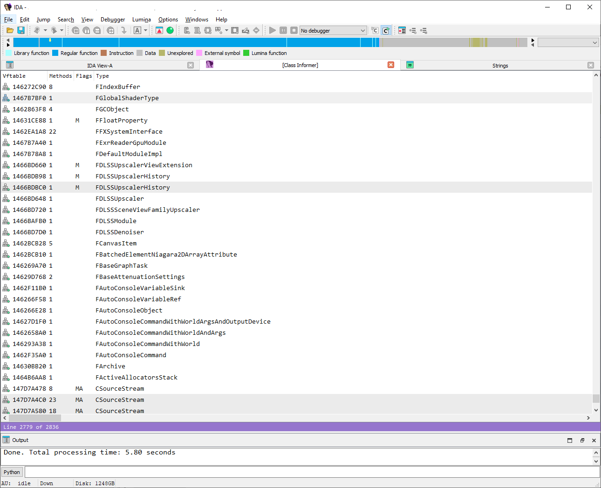

## Class Informer

**Kevin Weatherman aka "Sirmabus"**
**Repo [Github](https://github.com/kweatherman/IDA_ClassInformer_PlugIn), former: [SourceForge](https://sourceforge.net/projects/classinformer/)**  

Class Informer is a plug-in for [Hex-Rays IDA Pro](https://hex-rays.com/ida-pro/), designed to scan Microsoft Visual C++ (MSVC) binaries for virtual function tables (vftables) using C++ [Run-Time Type Identification (RTTI)](http://en.wikipedia.org/wiki/RTTI) data. It enhances reverse engineering by naming, labeling, and commenting vftables, defining associated data structures, and providing a browsable list window for class objects.

Note: This plug-in is tailored for MSVC-compiled binaries. Results may be unpredictable with other compilers.

Based on Igor Skochinsky’s article, [Reversing Microsoft Visual C++](http://www.openrce.org/articles/full_view/23), and updated insights from [Recon 2012](http://www.hexblog.com/wp-content/uploads/2012/06/Recon-2012-Skochinsky-Compiler-Internals.pdf).

------

#### Update & Status

Long overdue for an update. In particular for major IDA Pro version 9 (now 9.2).

* Has been for a while since , most certainly with version 9, that IDA's own built-in *rtti.dll* plugin does an excellent job of finding and labeling RTTI data.
  In some testing with my latest version, Class Informer typically only finds a very small percent, if any at all, of RTTI placements that IDA doesn't find.
  So now while it does scan for missing RTTI data structures, it only sets types for those that IDA hasn't already. As IDA's plugin has superior placement (labeling each data struct field, etc). Now Class Informer is more of a gather and display tool for an RTTI list view.

* Been a while since I've seen a [Crackto](https://democyclopedia.wordpress.com/2019/03/26/c-for-cracktros/), Demotro, demoscene graphics intro, so feeling creative I added one to make the
   **worlds first IDA "Plug-intro"**!  But if thy offends thee, you can disable it from running by setting your hotkey for it in your Ida "plugins.cfg" config file:

  ```
  Normal/default:
  IDA_ClassInformer IDA_ClassInformer Alt-2 0 WIN
  
  Without MOD music:
  IDA_ClassInformer IDA_ClassInformer Alt-2 1 WIN
  
  No intro at all:
  IDA_ClassInformer IDA_ClassInformer Alt-2 2 WIN
  ```

  Note I to use "Alt-2" as a hotkey, you'll probably need to edit your "idagui.cfg" file like this `"WindowActivate2": [0], //["Alt-2"],` to free it up.
  I disable most of the number key ones to use for various plugins, but there are many hotkey combinations free.

------

#### Features

- **Scans** for vftables with RTTI data in MSVC-compiled IDBs.
- **Places** structures, names, labels, and comments for vftables.
- **Defines** known data structures to aid analysis.
- **Generates** a list window to browse classes by name, with jump-to functionality.
- **Identifies** class hierarchies: single inheritance (SI), multiple inheritance (MI), virtual inheritance (VI), or combinations.
- **Processes** static initializers and terminators (constructors/destructors) for cleaner IDBs.

------

#### Installation

1. Copy the Class_Informer.plw plug-in to your IDA Pro plugins directory.

2. Edit plugins.cfg in the same directory to assign a hotkey. Example:

   ```text
   ; Sirmabus "Class Informer" plug-in
   Class-Informer IDA_ClassInformer_PlugIn Alt-2 0
   ```

3. Refer to IDA Pro documentation for additional plug-in setup details.

------

#### Usage

Launch Class Informer via:

- Assigned hotkey (e.g., Alt-2).
- IDA Pro’s Edit > Plugins menu.

###### Dialog Options



- **Place structures**: Enable to define RTTI data structures; disable to clean up data elements with comments only.
- **Process static initializers & terminators**: Enable to process constructor/destructor tables; disable to skip.
- **Audio on completion**: Enable for a sound when scanning completes; disable for silence.

###### Output

Upon completion, a list window displays found vftables with details:

- **Format**: vftable_address | method_count | class_hierarchy; additional_info
- **Example**: 0046769C 077 CEdit:CWnd, CCmdTarget, CObject; (SI)
- **Details**:
  - vftable_address: Memory address of the vftable.
  - method_count: Number of methods in the vftable.
  - class_hierarchy: Inheritance chain (e.g., CEdit:CWnd).
  - additional_info: (SI) for single inheritance, (MI) for multiple, (VI) for virtual, or (MI VI) for mixed.
- **Navigation**: Click a line to jump to its vftable in the IDB.
- **Styling**: Non-primary classes in multiple inheritance are grayed out.

Class names are labeled as “class” by default unless prefixed with “struct” to indicate a structure type.



------

#### Design

Class Informer builds on Igor Skochinsky’s RTTI research, transitioning from IDC scripts to a plug-in for speed and flexibility. Key improvements:

------

#### Acknowledgments

- **Igor Skochinsky**: For foundational RTTI insights and inspiration.
- **sh!ft**: For source code contributions and scanning improvements.
- **jlnsrk**: For 64-bit RTTI reverse engineering.
- **Chris Eagle**: For featuring Class Informer in his: *[The IDA Pro Book: The Unofficial Guide to the World’s Most Popular Disassembler](https://www.amazon.com/IDA-Pro-Book-Unofficial-Disassembler/dp/1593272898/)*.
- **Thomas Laurits Vedel Mogensen** **aka "Drax"**: For the gracious permission to use his music 'Building Up and Down' for the plug-intro.
- **Jeff Minter**:  For teaching me his "video feedback" graphics effect at Atari back in the Jaguar days.

------

##### License

**MIT License**
Copyright © 2009–present Kevin Weatherman  

Permission is hereby granted, free of charge, to any person obtaining a copy of this software and associated documentation files (the "Software"), to deal in the Software without restriction, including without limitation the rights to use, copy, modify, merge, publish, distribute, sublicense, and/or sell copies of the Software, and to permit persons to whom the Software is furnished to do so, subject to the following conditions:

The above copyright notice and this permission notice shall be included in all copies or substantial portions of the Software.

THE SOFTWARE IS PROVIDED "AS IS", WITHOUT WARRANTY OF ANY KIND, EXPRESS OR IMPLIED, INCLUDING BUT NOT LIMITED TO THE WARRANTIES OF MERCHANTABILITY, FITNESS FOR A PARTICULAR PURPOSE, AND NONINFRINGEMENT. IN NO EVENT SHALL THE AUTHORS OR COPYRIGHT HOLDERS BE LIABLE FOR ANY CLAIM, DAMAGES, OR OTHER LIABILITY, WHETHER IN AN ACTION OF CONTRACT, TORT, OR OTHERWISE, ARISING FROM, OUT OF, OR IN CONNECTION WITH THE SOFTWARE OR THE USE OR OTHER DEALINGS IN THE SOFTWARE.

See [MIT License](http://www.opensource.org/licenses/mit-license.php) for full details.

------

